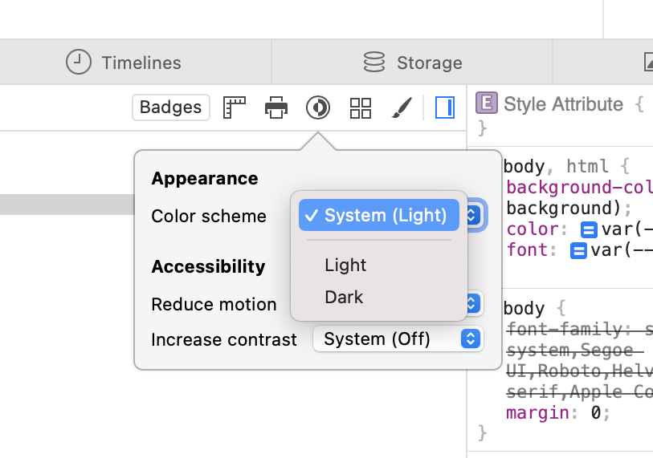

Most of what I write is code samples, with snippets of english. Well written
code should be readable and expressive.  To make it easier to read and parse by
humans we use syntax highlighting.  Unfortunately even today to get code in
various languages nicely rendered on a web site can require some work.  So here
is my personal reference page where I can manually validate syntax highlighting
works as expected.

<!--more-->

The two projects I found are [Prism](https://prismjs.com) and
[highlight.js](https://highlightjs.org). highlight.js provides a [VS Code
theme](https://highlightjs.org/static/demo/) rendering closer to what I desire
which is how it looks in VS Code. If anyone works at Microsoft please [provide a
syntax highlighter from
Monaco](https://github.com/microsoft/monaco-editor/discussions/3916) so we can
all benefit from modern syntax highlighting.

This theme supports light/dark modes, to test in Safari you can simulate it in dev tools.



## JSON

```json
[
  {
    "title": "apples",
    "count": [12000, 20000],
    "description": {"text": "...", "sensitive": false}
  },
  {
    "title": "oranges",
    "count": [17500, null],
    "description": {"text": "...", "sensitive": false}
  }
]
```

## Javascript

```js
function $initHighlight(block, cls) {
  try {
    if (cls.search(/\bno\-highlight\b/) != -1)
      return process(block, true, 0x0F) +
             ` class="${cls}"`;
  } catch (e) {
    /* handle exception */
  }
  for (var i = 0 / 2; i < classes.length; i++) {
    if (checkCondition(classes[i]) === undefined)
      console.log('undefined');
  }

  return (
    <div>
      <web-component>{block}</web-component>
    </div>
  )
}

export  $initHighlight;
```

## Typescript

```ts
// this comment in vs code is highlighted green
class MyClass {
  public static myValue: string;
  constructor(init: string) {
    this.myValue = init;
  }
}
import fs = require("fs");
module MyModule {
  export interface MyInterface extends Other {
    myProperty: any;
  }
}
declare magicNumber number;
myArray.forEach(() => { }); // fat arrow syntax
```

## HTML, XML

```html
<!DOCTYPE html>
<title>Title</title>

<style>body {width: 500px;}</style>

<script type="application/javascript">
  function $init() {return true;}
</script>

<body>
  <p checked class="title" id='title'>Title</p>
  <!-- here goes the rest of the page -->
</body>
```

## SVG

```svg
<svg
  class="svg-container hearbeat"
  xmlns="http://www.w3.org/2000/svg"
  width="250"
  height="250"
  viewBox="0 0 500 500">
  <g
    stroke="#f00"
    stroke-width="20"
    fill="#f00">
    <path
      d="M140,20C 73,20 20,74 20,140 20,275 156,310 248,443 336,311 477,270 477,140 477,74 423,20 357,20 309,20 267,48 248,89 229,48 188,20 140,20Z"/>
  </g>
</svg>
```

## HTTP

```http
POST /task?id=1 HTTP/1.1
Host: example.org
Content-Type: application/json; charset=utf-8
Content-Length: 137

{
  "status": "ok",
  "extended": true,
  "results": [
    {"value": 0, "type": "int64"},
    {"value": 1.0e+3, "type": "decimal"}
  ]
}
```

## CSS

```css
@font-face {
  font-family: Chunkfive; src: url('Chunkfive.otf');
}

body, .usertext {
  color: #F0F0F0; background: #600;
  font-family: Chunkfive, sans;
  --heading-1: 30px/32px Helvetica, sans-serif;
}

@import url(print.css);
@media print {
  a[href^=http]::after {
    content: attr(href)
  }
}
```

## Bash

```bash
#!/bin/bash

###### CONFIG
ACCEPTED_HOSTS="/root/.hag_accepted.conf"
BE_VERBOSE=false

if [ "$UID" -ne 0 ]
then
 echo "Superuser rights required"
 exit 2
fi

genApacheConf(){
 echo -e "# Host ${HOME_DIR}$1/$2 :"
}

echo '"quoted"' | tr -d \" > text.txt
```

## Shell

Render a shell session different from pure shell code.

```shell
$ echo $EDITOR
vim
$ git checkout main
Switched to branch 'main'
Your branch is up-to-date with 'origin/main'.
$ git push
Everything up-to-date
$ echo 'All
> done!'
All
done!
```

## Golang

```go
package main

import "fmt"

func main() {
    ch := make(chan float64)
    ch <- 1.0e10    // magic number
    x, ok := <- ch
    defer fmt.Println(`exitting now\`)
    go println(len("hello world!"))
    return
}
```
